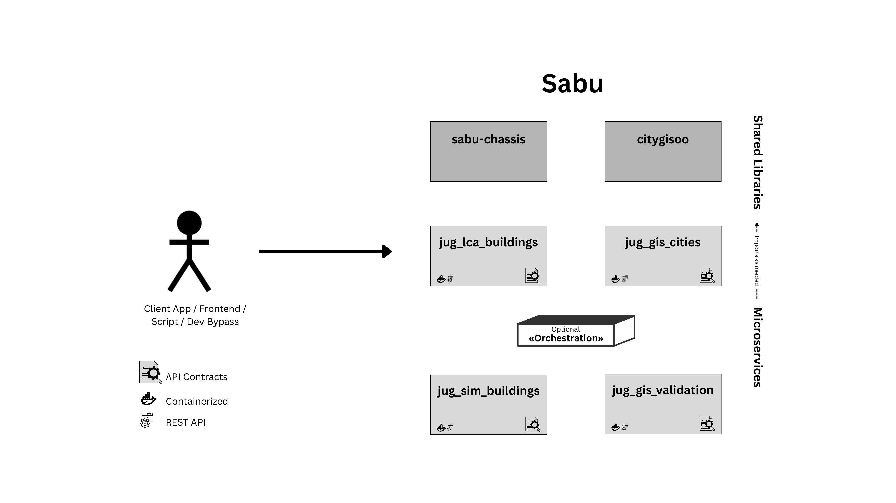

# Architecture Overview

Sabu uses a microservices architecture. Client applications, frontends, scripts, or development bypass tools call the service APIs directly, while optional orchestration can coordinate multi-step workflows when a use case needs more than one service.

The current architecture is supported by two shared libraries:

- `sabu-chassis` provides common framework behavior, conventions, and reusable infrastructure used by the services.
- `citygisoo` provides object-oriented GIS utilities and data-cleaning abstractions used by the geospatial services.

These shared libraries help make the three current services workable as independent jugs:

- `jug_lca_buildings` evaluates building life-cycle carbon emissions.
- `jug_gis_cities` runs city-scale geospatial data-cleaning workflows.
- `jug_gis_validation` validates geospatial datasets, including cleaned GeoJSON outputs.

The shared libraries are not deployed as services. They are installed and imported by the service code, while each jug remains independently containerized and exposes its own REST API and API contract.
